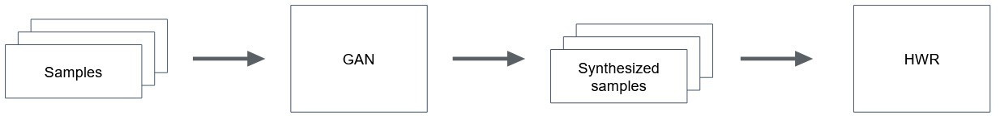

# Handwritten Word Recognition Pipeline

Deep learning technologies have greatly improved the performance of modern hand-written  word  recognition.   
However, a huge amount and variety of data is needed for training the model.  
We propose an automated writer adaption approach with  which  a  trained  handwritten  word  recognizer  could  adjust  towards  a  new  writing style.  
To achieve this goal, synthesized samples from a writer are produced by a generative adversarial network and forwarded to fine-tune the recognizer. 



More information about the models used can be found here:

* [research-seq2seq-HTR](http://www.cvc.uab.es/~marcal/pdfs/GCPR18.pdf)
* [research-GANwriting](https://arxiv.org/abs/2003.02567)

## Installation

The necessary dependencies can be installed with `pip install -r requirements.txt`. This project runs with `python 3.8`.  
For testing the models and calculating the CER, `gawk` has to be installed: `apt install gawk`.

## Pretrained Models
Pretrained models for both the HWR and the GAN are part of this repository and can be downloaded via git-lfs. 
Simply install git-lfs and run `git lfs pull`. (Don't forget to run `git lfs install` if you're using git-lfs for the first time).  
Other models can also be used but need to be referenced in the `config.yaml`.
## Usage
The `synthesized_training.py` script starts the pipeline. By default, it expects input images in the `input_images` folder.

One can also optionally test the trained model. 
For doing this, put test images in the default `test_images` folder and also a labels.txt file for these images that looks like this:
```
test_img_1.png hello
test_img_2.png world
```
Afterwards the pipeline can be started with `python3 synthesized_training.py -t`

If writers of the IAM dataset should be trained, the IAM words directory needs to be referenced in the `config.yaml` file.
Then a given writer can be trained with `python3 synthesized_training.py --iam <Writer_ID>`. 
Testing can again be executed with the `-t` flag. 
Testing is done on all images of this specific writer in the IAM dataset.
The number of images to be synthesized can be adapted with the `--n_generated_images` flag.


## Folder structure 
1. HWR/ - Code of the Handwritten Word Recognizer ([research-seq2seq-HTR](https://github.com/omni-us/research-seq2seq-HTR))
2. GAN/ - Code of the Generative Adversarial Network ([research-GANwriting](https://github.com/omni-us/research-GANwriting))
3. pretrained_models/ - Pretrained models of both the GAN and the HWR
4. data/ - Contains mapping from IAM writers to their images

Output Folder:
1. model_weights/ - Saves the trained models after running the pipeline
2. evaluations/ - Saves the predictions of the models
3. synthesized_images/ - Saves images generated by the GAN
4. label_files/ - Saves the labels for generated images
